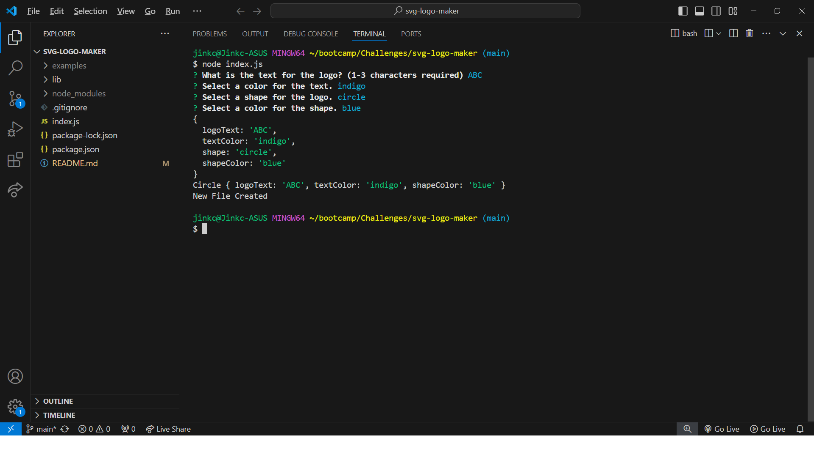
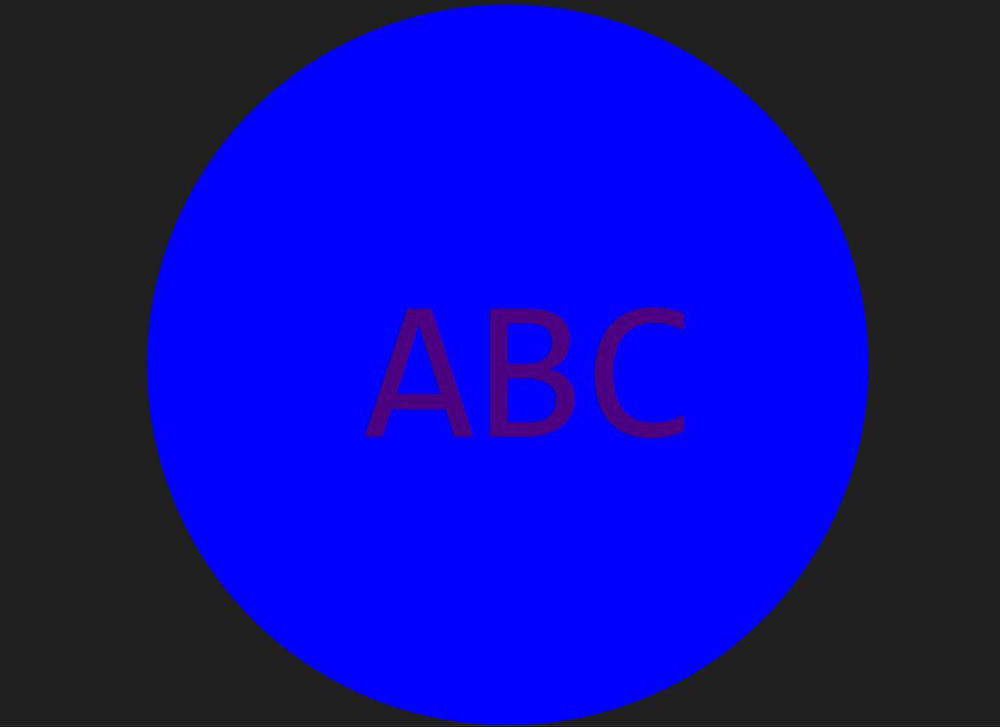

# SVG Logo Maker

## Description

Coming up with a new logo can be difficult and time consuming. This application allows users to quickly and easily create logos. With just a few inputs, a customer logo is created as an SVG file.

## Table of Contents (Optional)

If your README is long, add a table of contents to make it easy for users to find what they need.

- [Installation](#installation)
- [Usage](#usage)
- [Credits](#credits)
- [License](#license)

## Installation

1. Install node and run npm init -y (-y is optional to skip prompts)
2. Download repository from [git@github.com:jinkc21/svg-logo-maker.git](https://github.com/jinkc21/svg-logo-maker.git)
3. Install Inquirer version 8.2.4
4. Install fs

## Usage

Run node index.js in the terminal. A set of questions will prompt. 

After user inputs are received, and new SVG file is created with the custom logo.

## Credits

Many SVG tutorials and resources were used to write this project. 

* [Scalable Vector Graphics (SVG)](https://en.wikipedia.org/wiki/Scalable_Vector_Graphics)

* [SVG tutorial](https://developer.mozilla.org/en-US/docs/Web/SVG/Tutorial)

* [Basic SVG shapes](https://developer.mozilla.org/en-US/docs/Web/SVG/Tutorial/Basic_Shapes)

* [Text in SVG](https://developer.mozilla.org/en-US/docs/Web/SVG/Tutorial/Texts)

* [SVG VS Code extension](https://marketplace.visualstudio.com/items?itemName=jock.svg)

SVG Viewer was used to work on codes for SVG shapes.
https://www.svgviewer.dev/ 

## License

MIT License

Copyright (c) [2024] [jinkc21]

Permission is hereby granted, free of charge, to any person obtaining a copy
of this software and associated documentation files (the "Software"), to deal
in the Software without restriction, including without limitation the rights
to use, copy, modify, merge, publish, distribute, sublicense, and/or sell
copies of the Software, and to permit persons to whom the Software is
furnished to do so, subject to the following conditions:

The above copyright notice and this permission notice shall be included in all
copies or substantial portions of the Software.

THE SOFTWARE IS PROVIDED "AS IS", WITHOUT WARRANTY OF ANY KIND, EXPRESS OR
IMPLIED, INCLUDING BUT NOT LIMITED TO THE WARRANTIES OF MERCHANTABILITY,
FITNESS FOR A PARTICULAR PURPOSE AND NONINFRINGEMENT. IN NO EVENT SHALL THE
AUTHORS OR COPYRIGHT HOLDERS BE LIABLE FOR ANY CLAIM, DAMAGES OR OTHER
LIABILITY, WHETHER IN AN ACTION OF CONTRACT, TORT OR OTHERWISE, ARISING FROM,
OUT OF OR IN CONNECTION WITH THE SOFTWARE OR THE USE OR OTHER DEALINGS IN THE
SOFTWARE.

---

## Tests

Test packages are avaiable. If users would like to run the tests, they must install jest. Shapes.test.js will test the functionality of each shape and whether or not the inputs selected match the expected output. 